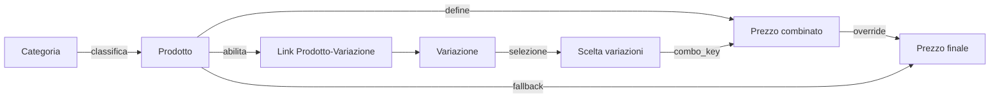

# Schema prodotti: categorie, variazioni e combinazioni

Documento operativo per descrivere come funzionano categorie, prodotti, variazioni e prezzi combinati in MediaPrint ERP.

## 1) Schema ER (Mermaid)
```mermaid
erDiagram
  TB_CATEGORIE ||--o{ TB_PRODOTTI : "id_categoria"
  TB_PRODOTTI ||--o{ APPOGGIO_PRODOTTO_VARIAZIONE : "id_prodotto"
  TB_VARIAZIONI ||--o{ APPOGGIO_PRODOTTO_VARIAZIONE : "id_variazione"
  TB_PRODOTTI ||--o{ TB_PREZZI_VARIAZIONI : "id_prodotto"

  TB_CATEGORIE {
    int id_categoria PK
    varchar nome
    text descrizione
  }

  TB_PRODOTTI {
    int id_prodotto PK
    int id_categoria FK
    varchar codice
    varchar nome
    text descrizione
    decimal prezzo_listino
    int id_iva
    int id_sdi_natura_iva
    tinyint attivo
  }

  TB_VARIAZIONI {
    int id_variazione PK
    varchar codice
    varchar nome
    varchar categoria
    decimal prezzo
  }

  APPOGGIO_PRODOTTO_VARIAZIONE {
    int id_prodotto FK
    int id_variazione FK
    PK "id_prodotto,id_variazione"
  }

  TB_PREZZI_VARIAZIONI {
    int id PK
    int id_prodotto FK
    varchar combo_key
    decimal prezzo
  }
```

## 2) Schema visuale (flusso)


## 3) Regole operative (sintesi)
- Un prodotto puo' avere una sola categoria.
- Un prodotto puo' avere molte variazioni; una variazione puo' essere usata da piu' prodotti.
- Le variazioni sono raggruppate in UI tramite il campo testuale `categoria` di `tb_variazioni`.
- Un prezzo combinato e' definito su un prodotto e su un set di variazioni (combo_key).
- combo_key = ID variazioni ordinati e uniti con `+` (es. `12+45`).
- Se esiste un prezzo combinato, si usa quello; altrimenti si usa il prezzo_listino del prodotto.
- La tabella ponte `appoggio_prodotto_variazione` non contiene piu' delta prezzo (rimosso).

## 4) Esempi pratici

### Esempio A: prezzo combinato presente
- Prodotto: "Busta A4" (id_prodotto=10), prezzo_listino=1.00
- Variazioni abilitate: 5="Colore Rosso", 8="Finestra Si'"
- Selezione utente: [5, 8] => combo_key "5+8"
- Prezzo combinato registrato: 1.30
- Prezzo finale: 1.30

### Esempio B: prezzo combinato assente
- Prodotto: "Etichetta 100x50" (id_prodotto=22), prezzo_listino=0.80
- Selezione: [3, 9] => combo_key "3+9"
- Nessun prezzo combinato registrato
- Prezzo finale: 0.80

### Esempio C: collegamento variazioni a un prodotto
- Prodotto 10 abilita variazioni 5, 8, 12
- La UI mostra solo queste variazioni per il prodotto 10

## 5) Checklist rapida per l'uso
- Creare categoria (se necessaria)
- Creare prodotto e associarlo alla categoria
- Creare variazioni (con categoria testuale per raggruppamento)
- Collegare variazioni al prodotto (link)
- Definire prezzi combinati dove serve

## 6) Glossario
- Categoria: famiglia di prodotti (es. "Stampa & Imbustamento")
- Variazione: opzione selezionabile (es. colore, formato)
- Combo key: chiave deterministica per un set di variazioni
- Prezzo combinato: prezzo finale alternativo al listino

