# Schema ER sintetico

Schema ER logico ad alto livello del gestionale. Le relazioni sotto sono
orientate ai flussi applicativi principali e non sostituiscono il dump SQL
completo (`sql/mediaprint_erp_v2.sql`).

```mermaid
erDiagram
    CFG_AUTH_ACCOUNTS ||--o{ CFG_AUTH_ACCOUNT_PERMISSIONS : has
    CFG_AUTH_PERMESSI ||--o{ CFG_AUTH_ACCOUNT_PERMISSIONS : grants
    CFG_AUTH_ACCOUNTS ||--o{ TB_IM_ACCOUNTS : maps
    CFG_AUTH_ACCOUNTS ||--o{ TB_LAVORAZIONI_NOTIFICHE : receives

    TB_ANAGRAFICHE ||--o{ TB_CONTRATTI : owns
    TB_ANAGRAFICHE ||--o{ TB_PREVENTIVI : requests
    TB_ANAGRAFICHE ||--o{ TB_DDT : recipient
    TB_ANAGRAFICHE ||--o{ TB_FATTURE : billed_to
    TB_ANAGRAFICHE ||--o{ TB_PAGAMENTI : payer

    TB_PRODOTTI ||--o{ TB_PRODOTTI_VARIAZIONI : has
    TB_PRODOTTI_CATEGORIE ||--o{ TB_PRODOTTI : groups
    TB_PACCHETTI ||--o{ TB_PACCHETTI_RIGHE : includes
    TB_PRODOTTI ||--o{ TB_PACCHETTI_RIGHE : references
    TB_PRODOTTI_VARIAZIONI ||--o{ TB_PACCHETTI_RIGHE : optional_variant

    TB_PREVENTIVI ||--o{ TB_PREVENTIVI_RIGHE : includes
    TB_PREVENTIVI ||--o{ TB_PREVENTIVI_REVISIONI : tracks
    TB_PREVENTIVI ||--o| TB_DDT : emits
    TB_PREVENTIVI ||--o| TB_FATTURE : emits
    TB_PREVENTIVI ||--o{ TB_LAVORAZIONI : generates

    TB_DDT ||--o{ TB_DDT_RIGHE : includes
    TB_FATTURE ||--o{ TB_FATTURE_RIGHE : includes
    TB_FATTURE ||--o{ TB_FATTURE_PAGAMENTI : settles
    TB_PAGAMENTI ||--o{ TB_FATTURE_PAGAMENTI : allocates

    TB_LAVORAZIONI ||--o{ TB_LAVORAZIONI_ATTIVITA : has
    TB_LAVORAZIONI ||--o{ TB_LAVORAZIONI_FILES : stores
    CFG_AUTH_ACCOUNTS ||--o{ TB_LAVORAZIONI_ASSEGNAZIONI : assigned
    TB_LAVORAZIONI ||--o{ TB_LAVORAZIONI_ASSEGNAZIONI : assignment

    TB_IM_THREADS ||--o{ TB_IM_MESSAGES : contains
    TB_IM_ACCOUNTS ||--o{ TB_IM_THREAD_PARTICIPANTS : joins
    TB_IM_THREADS ||--o{ TB_IM_THREAD_PARTICIPANTS : members
    TB_IM_ACCOUNTS ||--o{ TB_IM_MESSAGES : sends

    TB_TICKETS ||--o{ TB_TICKETS_COMMENTS : has
    CFG_AUTH_ACCOUNTS ||--o{ TB_TICKETS : opens
    CFG_AUTH_ACCOUNTS ||--o{ TB_TICKETS_COMMENTS : writes
```

## Lettura per dominio
- Sicurezza: account e permessi (`cfg_auth_*`) governano accesso FE/BE.
- Commerciale: anagrafiche, preventivi, DDT, fatture, pagamenti.
- Produzione: lavorazioni, attivita, assegnazioni e file operativi.
- Catalogo: prodotti/categorie/variazioni e pacchetti con righe.
- Comunicazione: IM (thread/messaggi) e notifiche lavorazioni.
- Supporto: ticket e commenti; timeline release notes su modulo dedicato.

## Nota
- Nomi tabella e cardinalita sono sintetici e possono differire dal naming
  fisico in alcuni punti; per il dettaglio vincoli/FK usare il dump SQL.
